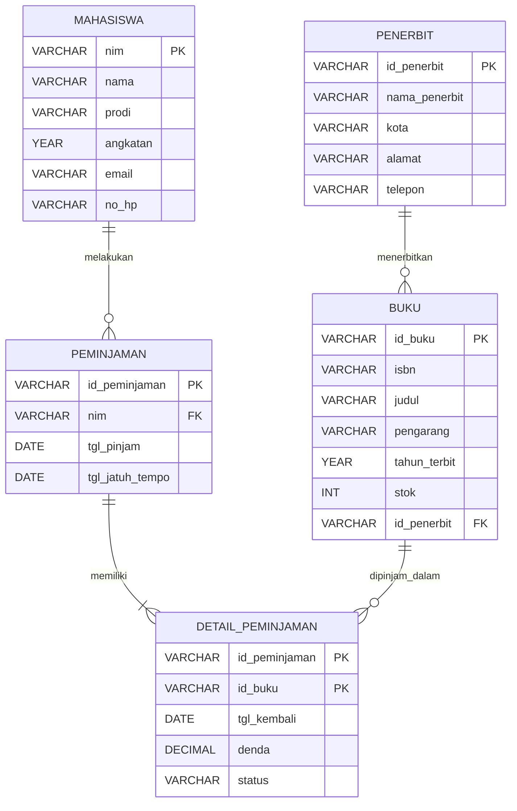

# Tugas Modul 6: Perancangan ERD E-Library Kampus

**Nama:** Nurul Fauziah Mustafa
**NIM:** D121241035

## 1. Skenario

Basis data relasional untuk sistem peminjaman buku perpustakaan kampus.
Sistem mencatat data mahasiswa, buku, penerbit, serta riwayat peminjaman
dan pengembalian.

**Aturan bisnis:**
- Satu penerbit dapat menerbitkan banyak buku, satu buku hanya punya satu penerbit.
- Satu mahasiswa dapat melakukan banyak transaksi peminjaman.
- Satu transaksi dapat memuat lebih dari satu buku.
- Satu buku dapat dipinjam berkali-kali pada transaksi yang berbeda.
- Setiap buku dalam transaksi punya tanggal kembali sendiri-sendiri.

## 2. Identifikasi Entitas dan Atribut

| Entitas | Atribut | PK | FK |
|---|---|---|---|
| Mahasiswa | nim, nama, prodi, angkatan, email, no_hp | nim | - |
| Penerbit | id_penerbit, nama_penerbit, kota, alamat, telepon | id_penerbit | - |
| Buku | id_buku, isbn, judul, pengarang, tahun_terbit, stok, id_penerbit | id_buku | id_penerbit |
| Transaksi Peminjaman (header) | id_peminjaman, nim, tgl_pinjam, tgl_jatuh_tempo | id_peminjaman | nim |
| Transaksi Peminjaman (detail) | id_peminjaman, id_buku, tgl_kembali, denda, status | (id_peminjaman, id_buku) | id_peminjaman, id_buku |

**Relasi antar entitas:**
- Penerbit 1 : N Buku
- Mahasiswa 1 : N Peminjaman
- Peminjaman 1 : N Detail Peminjaman
- Buku 1 : N Detail Peminjaman
- Maka Peminjaman dan Buku berelasi M:N melalui Detail Peminjaman.

## 3. Simulasi Normalisasi

### 3.1 Bentuk Tidak Normal (UNF)

Data mentah dalam satu tabel. Kolom buku berisi **kelompok berulang**
karena satu transaksi bisa meminjam lebih dari satu buku.

| id_peminjaman | nim | nama_mhs | prodi | email | tgl_pinjam | tgl_jatuh_tempo | tgl_kembali | id_buku | judul | pengarang | tahun_terbit | id_penerbit | nama_penerbit | kota_penerbit |
|---|---|---|---|---|---|---|---|---|---|---|---|---|---|---|
| PJ001 | 2026001 | Andi Pratama | Informatika | andi@kampus.ac.id | 2026-09-01 | 2026-09-08 | 2026-09-07 | B001, B002 | Basis Data, Algoritma | Elmasri, Cormen | 2016, 2022 | P01, P02 | Informatika Press, Gramedia | Bandung, Jakarta |
| PJ002 | 2026002 | Siti Aulia | Sistem Informasi | siti@kampus.ac.id | 2026-09-03 | 2026-09-10 | NULL | B001 | Basis Data | Elmasri | 2016 | P01 | Informatika Press | Bandung |

**Masalah:** satu sel berisi banyak nilai (tidak atomik) dan ada kelompok berulang.

### 3.2 Bentuk Normal Pertama (1NF)

**Aturan:** setiap sel hanya berisi satu nilai (atomik) dan tidak ada
kelompok berulang. Kelompok berulang dipecah menjadi baris-baris terpisah.
Primary key menjadi **gabungan (id_peminjaman, id_buku)**.

| id_peminjaman (PK) | id_buku (PK) | nim | nama_mhs | prodi | email | tgl_pinjam | tgl_jatuh_tempo | tgl_kembali | judul | pengarang | tahun_terbit | id_penerbit | nama_penerbit | kota_penerbit |
|---|---|---|---|---|---|---|---|---|---|---|---|---|---|---|
| PJ001 | B001 | 2026001 | Andi Pratama | Informatika | andi@kampus.ac.id | 2026-09-01 | 2026-09-08 | 2026-09-07 | Basis Data | Elmasri | 2016 | P01 | Informatika Press | Bandung |
| PJ001 | B002 | 2026001 | Andi Pratama | Informatika | andi@kampus.ac.id | 2026-09-01 | 2026-09-08 | 2026-09-07 | Algoritma | Cormen | 2022 | P02 | Gramedia | Jakarta |
| PJ002 | B001 | 2026002 | Siti Aulia | Sistem Informasi | siti@kampus.ac.id | 2026-09-03 | 2026-09-10 | NULL | Basis Data | Elmasri | 2016 | P01 | Informatika Press | Bandung |

**Hasil:** semua nilai sudah atomik. **Masalah tersisa:** data mahasiswa
dan buku diulang di banyak baris (redundansi).

### 3.3 Bentuk Normal Kedua (2NF)

**Aturan:** sudah 1NF dan tidak ada **ketergantungan parsial**, yaitu atribut
non-key yang hanya bergantung pada sebagian dari primary key gabungan.

**Analisis dependensi fungsional** (PK gabungan: id_peminjaman, id_buku):
- `id_peminjaman` → nim, nama_mhs, prodi, email, tgl_pinjam, tgl_jatuh_tempo (parsial)
- `id_buku` → judul, pengarang, tahun_terbit, id_penerbit, nama_penerbit, kota_penerbit (parsial)
- `id_peminjaman, id_buku` → tgl_kembali (utuh)

Maka tabel dipecah menjadi tiga.

**Tabel Peminjaman**

| id_peminjaman (PK) | nim | nama_mhs | prodi | email | tgl_pinjam | tgl_jatuh_tempo |
|---|---|---|---|---|---|---|
| PJ001 | 2026001 | Andi Pratama | Informatika | andi@kampus.ac.id | 2026-09-01 | 2026-09-08 |
| PJ002 | 2026002 | Siti Aulia | Sistem Informasi | siti@kampus.ac.id | 2026-09-03 | 2026-09-10 |

**Tabel Detail_Peminjaman**

| id_peminjaman (PK, FK) | id_buku (PK, FK) | tgl_kembali |
|---|---|---|
| PJ001 | B001 | 2026-09-07 |
| PJ001 | B002 | 2026-09-07 |
| PJ002 | B001 | NULL |

**Tabel Buku**

| id_buku (PK) | judul | pengarang | tahun_terbit | id_penerbit | nama_penerbit | kota_penerbit |
|---|---|---|---|---|---|---|
| B001 | Basis Data | Elmasri | 2016 | P01 | Informatika Press | Bandung |
| B002 | Algoritma | Cormen | 2022 | P02 | Gramedia | Jakarta |

**Hasil:** ketergantungan parsial hilang. **Masalah tersisa:** masih ada
ketergantungan transitif (nim → nama_mhs dan id_penerbit → nama_penerbit).

### 3.4 Bentuk Normal Ketiga (3NF)

**Aturan:** sudah 2NF dan tidak ada **ketergantungan transitif**, yaitu atribut
non-key yang bergantung pada atribut non-key lain.

**Analisis:**
- Di Peminjaman: `id_peminjaman → nim → nama_mhs, prodi, email`
- Di Buku: `id_buku → id_penerbit → nama_penerbit, kota_penerbit`

Atribut yang bergantung transitif dipindah ke tabel sendiri.

**Mahasiswa**

| nim (PK) | nama_mhs | prodi | email |
|---|---|---|---|
| 2026001 | Andi Pratama | Informatika | andi@kampus.ac.id |
| 2026002 | Siti Aulia | Sistem Informasi | siti@kampus.ac.id |

**Penerbit**

| id_penerbit (PK) | nama_penerbit | kota_penerbit |
|---|---|---|
| P01 | Informatika Press | Bandung |
| P02 | Gramedia | Jakarta |

**Buku**

| id_buku (PK) | judul | pengarang | tahun_terbit | id_penerbit (FK) |
|---|---|---|---|---|
| B001 | Basis Data | Elmasri | 2016 | P01 |
| B002 | Algoritma | Cormen | 2022 | P02 |

**Peminjaman**

| id_peminjaman (PK) | nim (FK) | tgl_pinjam | tgl_jatuh_tempo |
|---|---|---|---|
| PJ001 | 2026001 | 2026-09-01 | 2026-09-08 |
| PJ002 | 2026002 | 2026-09-03 | 2026-09-10 |

**Detail_Peminjaman** (tidak berubah)

| id_peminjaman (PK, FK) | id_buku (PK, FK) | tgl_kembali |
|---|---|---|
| PJ001 | B001 | 2026-09-07 |
| PJ001 | B002 | 2026-09-07 |
| PJ002 | B001 | NULL |

**Hasil:** semua tabel sudah 3NF. Data mahasiswa dan penerbit tersimpan satu
kali, sehingga tidak ada anomali insert, update, maupun delete.

## 4. Rancangan Tabel Akhir

### 4.1 Tabel `mahasiswa`

| Kolom | Tipe Data | Kunci | Keterangan |
|---|---|---|---|
| nim | VARCHAR(15) | PK | Nomor induk mahasiswa |
| nama | VARCHAR(100) | - | NOT NULL |
| prodi | VARCHAR(50) | - | NOT NULL |
| angkatan | YEAR | - | Tahun masuk |
| email | VARCHAR(100) | - | UNIQUE |
| no_hp | VARCHAR(15) | - | Boleh NULL |

### 4.2 Tabel `penerbit`

| Kolom | Tipe Data | Kunci | Keterangan |
|---|---|---|---|
| id_penerbit | VARCHAR(10) | PK | Contoh: P01 |
| nama_penerbit | VARCHAR(100) | - | NOT NULL |
| kota | VARCHAR(50) | - | |
| alamat | VARCHAR(200) | - | |
| telepon | VARCHAR(15) | - | |

### 4.3 Tabel `buku`

| Kolom | Tipe Data | Kunci | Keterangan |
|---|---|---|---|
| id_buku | VARCHAR(10) | PK | Contoh: B001 |
| isbn | VARCHAR(20) | - | UNIQUE |
| judul | VARCHAR(150) | - | NOT NULL |
| pengarang | VARCHAR(100) | - | NOT NULL |
| tahun_terbit | YEAR | - | |
| stok | INT | - | DEFAULT 0, tidak boleh negatif |
| id_penerbit | VARCHAR(10) | FK | Mengacu ke penerbit(id_penerbit) |

### 4.4 Tabel `peminjaman`

| Kolom | Tipe Data | Kunci | Keterangan |
|---|---|---|---|
| id_peminjaman | VARCHAR(10) | PK | Contoh: PJ001 |
| nim | VARCHAR(15) | FK | Mengacu ke mahasiswa(nim) |
| tgl_pinjam | DATE | - | NOT NULL |
| tgl_jatuh_tempo | DATE | - | NOT NULL |

### 4.5 Tabel `detail_peminjaman`

| Kolom | Tipe Data | Kunci | Keterangan |
|---|---|---|---|
| id_peminjaman | VARCHAR(10) | PK, FK | Mengacu ke peminjaman(id_peminjaman) |
| id_buku | VARCHAR(10) | PK, FK | Mengacu ke buku(id_buku) |
| tgl_kembali | DATE | - | NULL jika belum dikembalikan |
| denda | DECIMAL(10,2) | - | DEFAULT 0 |
| status | VARCHAR(10) | - | 'Dipinjam' atau 'Kembali' |

## 5. Visualisasi Relasi (ERD)



**Diagram alur teks (alternatif):**

```
penerbit (1) ----< (N) buku (1) ----< (N) detail_peminjaman (N) >---- (1) peminjaman (N) >---- (1) mahasiswa
```